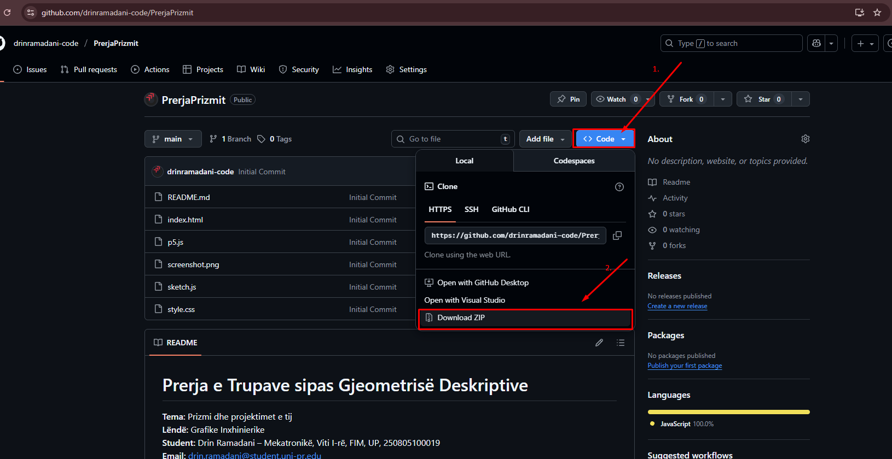
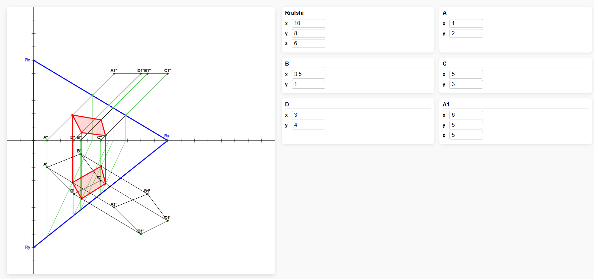

# Prerja e Trupave sipas Gjeometrisë Deskriptive

**Tema:** Prizmi dhe projektimet e tij  
**Lëndë:** Grafike Inxhinierike  
**Student:** Drin Ramadani – Mekatronikë, Viti I-rë, FIM, UP, 250805100019  
**Email:** drin.ramadani@student.uni-pr.edu  
**Profesor i lëndës:** Arbnor Pajaziti

---

## Përshkrimi i Projektit

Ky projekt fokusohet në **prerjen e trupave sipas gjeometrisë deskriptive**, me theks të veçantë në **prizmat** (me mbështetje të mëtutjeshme do të shtohen edhe koni, cilindri dhe figura tjera), me qëllim që të vizualizohet dhe të kuptohet mënyra se si krijohen prerjet dhe projektimet e prismave në **grafikën inxhinierike**.

Ky projekt përdor një **aplikacion interaktiv në JavaScript** që mundëson:

- Ndryshimin e koordinatave të prismës dhe rrafshit prerës
- Vizualizimin e prerjeve vertikale dhe pjerrëse
- Projektimet e kuqe dhe të gjelbërta për të ndjekur pikët e prerjes
- Vizatimin e rrafshit dhe bazës së prismës

---

## Udhëzime Përdorimi

1. ![Tutorial] Filloni duke bere "Download" projektin.
   
2. Hapni `index.html` në shfletuesin tuaj.
3. Përdorni **inputet numerike** për të ndryshuar koordinatat e prismës dhe rrafshit prerës (R, A, B, C, D, A1).
4. Shihni ndryshimet në **canvas-in interaktiv**.
5. Pikët e prerjes dhe projektimet vizualizohen automatikisht me ngjyra të ndryshme:
   - **E gjelbër:** Pikat origjinale të prismës
   - **E kuqe:** Pikat e prerjes
   - **Blu:** Rrafshi bazë

---

